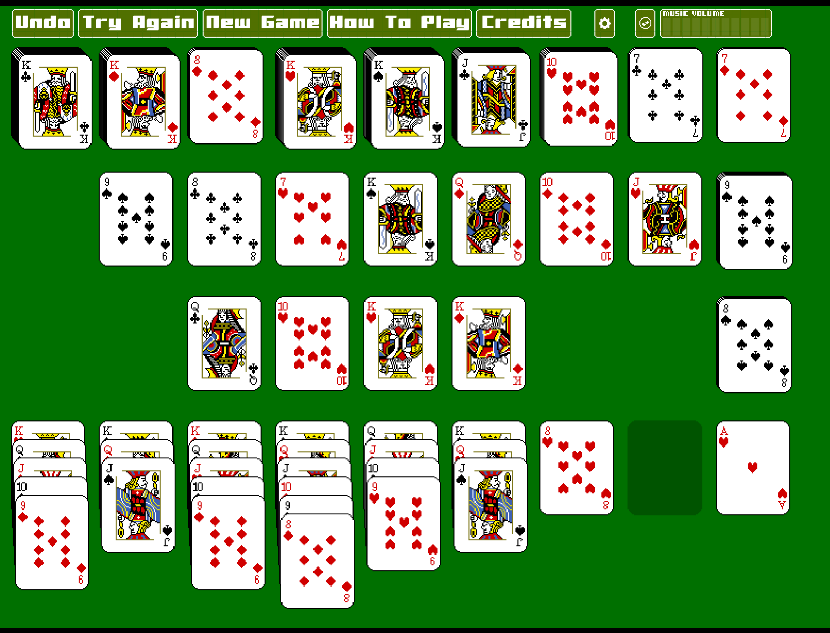
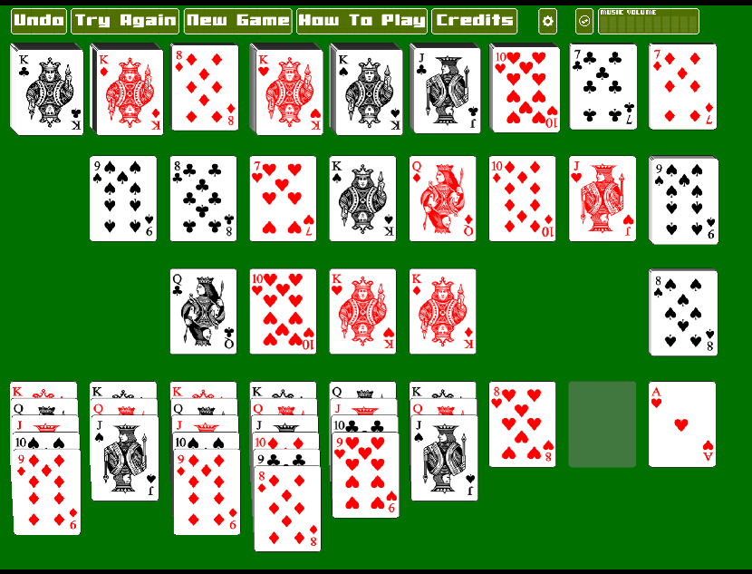
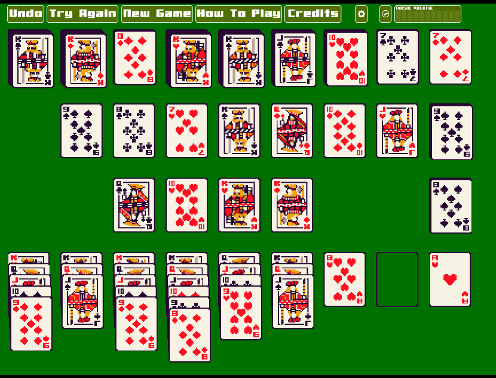
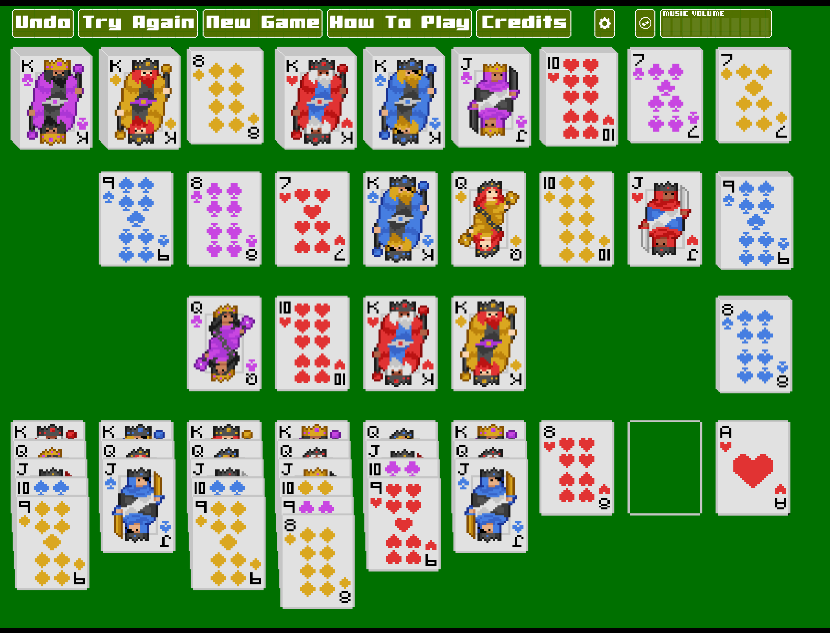

### Minden24

2024 Remake of an 1988 Amiga Patience style card game I enjoyed a lot back in the day.

Playable version: https://intensicode.github.io/minden24/

### Screenshots

### To Do

- [ ] title screen? or just popup how-to-play dialog?
- [ ] show how-to-play dialog initially if no title screen

- [X] BUG batch drag option should affect batch tap, too
- [X] BUG fix card overlay to match card set
- [X] BUG fix drag target size for card set size
- [X] BUG fix drag to match card set
- [X] BUG fix placeholder duplication
- [X] all options to make game == original
- [X] credits button (game and end)
- [X] end screen with poem and picture (original?)
- [X] fix kin set spacing
- [X] help button for showing how-to-play dialog
- [X] music selection dialog
